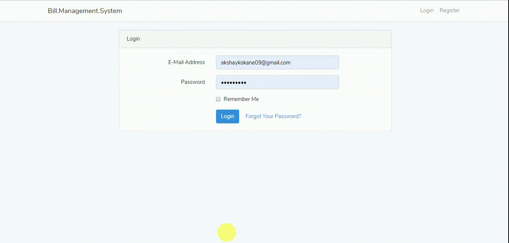

# Bills Management System for my apartment

I am staying at shared apartment at Athens, GA. I was sharing it with my 3 other firends. Me and my roomates used to spend hours to divide the bills. It was very tidious for us, as many time the grocerry biil, used to contain the items, which either belonged to all 4 of us or just 3 , 2 or 1 of us. We tried to use splitwise, but me and my roomates found it till difficult so splt such a confusing bills.
So I came up with the excel sheet, and calculated the shares by formulas. Then, I gave a thought, that lets automate it with better approach. Hence came up with this project

# Demo

